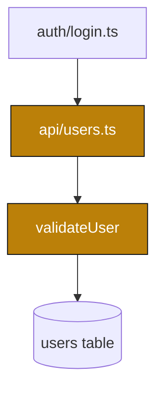

# aesop — output format

The story is a Markdown document, written to be both read in the terminal and
rendered to HTML. It must stay machine-parseable: code lives in `story-diff`
blocks, diagrams in `mermaid` blocks.

## Structure

1. **Title** — `# 📖 <PR title>` plus a one-line subtitle (`#<n> · <author> · <head> → <base>`).
2. **Summary** — one paragraph: what the PR accomplishes and why. No code yet.
3. **The story** — prose interspersed with `story-diff` snippets and Mermaid
   diagrams. Group by *intent*, not file order.
4. **The moral** — `## 📜 The moral` — risk table + "what to watch" (see
   [blast-radius.md](blast-radius.md)).

## story-diff blocks

Every code snippet is a fenced block with the `story-diff` info string and a
JSON metadata comment on the first line:

````
```story-diff
<!-- {"file": "src/api/users.ts", "commit": "a1b2c3d", "type": "addition", "description": "New user validation endpoint"} -->
+export async function validateUser(req: Request) {
+  const { email, password } = req.body;
+  if (!email || !password) throw new ValidationError('Missing credentials');
+}
```
````

Metadata fields: `file` (path), `commit` (short SHA, omit if not attributable to
one commit), `type` (`addition`|`deletion`|`modification`|`rename`|`context`),
`description` (brief label).

Snippet rules:
- Unified diff format: `+`/`-` for added/removed, leading space for context.
- Include a little surrounding context where it aids understanding.
- 5–40 lines each. Trim aggressively. For big structural additions show the
  shape/signature, not every line. Skip lock files, generated code, whitespace,
  import reordering.

## Line references

When prose must point at specific lines in the *immediately following* snippet:

- In prose: `**[N]**` — visible bold marker.
- In code: append `<!--ref:N-->` to the referenced line.
- `N` is unique across the whole story (1, 2, 3, …) — never restart.
- The prose `**[N]**` must appear *before* the snippet holding its `<!--ref:N-->`.
- Use only when it genuinely aids comprehension.

```story-diff
<!-- {"file": "src/db/pool.ts", "type": "addition", "description": "Pool with graceful shutdown"} -->
+const pool = new Pool({ max: 20 }); <!--ref:1-->
+process.on('SIGTERM', async () => { await pool.end(); <!--ref:2--> });
```

## Mermaid diagrams

Add a diagram when changes cross files, a call chain is non-obvious, or the
blast radius spans modules. Keep each diagram focused on one idea.

- **Call / dependency flow** → `graph TD`. Mark changed nodes, e.g. a `:::changed`
  class, and label edges with what flows.
- **Request / sequence changes** → `sequenceDiagram`.
- **State machines / lifecycles** → `stateDiagram-v2`.

````

````

Don't diagram trivial PRs. One or two diagrams for a medium PR; a few for a
large one. Prose still carries the narrative — diagrams support it.

## Narrative rules

- Tell a story, not a changelog: "First the author introduced…", "To support
  this they added…", "This forced an update to…".
- Multi-commit PRs: narrate the *evolution* commit by commit.
- Be opinionated. Highlight architectural decisions, tricky logic, non-obvious
  choices. Skip boilerplate.
- Weave in discussion context: "After review feedback the author switched to…",
  "As noted in the thread, this trade-off was intentional because…".
- Flag potential issues briefly where you see them — the deep read belongs in
  the moral.

## Length guidelines

| Diff size | snippets | prose | diagrams |
|-----------|----------|-------|----------|
| Small (<200 lines) | 3–8 | 500–1000 words | 0–1 |
| Medium (200–1000) | 5–15 | 1000–2000 words | 1–2 |
| Large (1000+) | 8–20 | 1500–3000 words | 2–4 |

Large PRs: be highly selective. Narrate the spine of the change, not every leaf.

These counts are the `intermediate` baseline. Scale them by the reader level's
multiplier — see [levels.md](levels.md) (outsider ~1.5×, senior ~0.6×).
