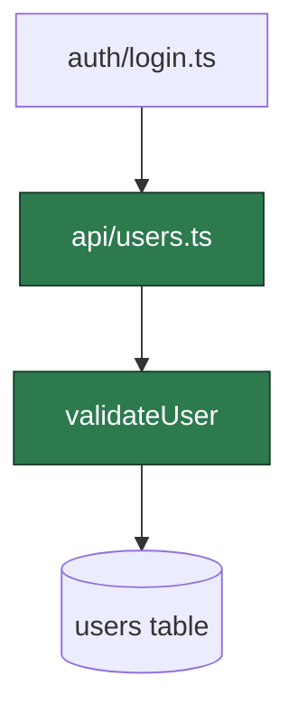

# aesop — output format

The story is a Markdown document that must render well in **three** places with
no per-target rewriting:

1. the Claude Code **terminal** (native markdown render),
2. a standalone **Markdown** file (GitHub etc.),
3. the standalone **HTML** viewer (`render-html.sh`).

The rule that makes this work: **use only native Markdown constructs.** Code goes
in standard fenced blocks (` ```diff `, ` ```rust `, …), diagrams in ` ```mermaid `.
No custom info strings, no JSON headers, no HTML comments inside code — those
render as literal noise in the terminal and on GitHub. The HTML viewer *upgrades*
the same plain markdown (diff coloring, bidirectional refs); it never requires a
special syntax.

## Structure

1. **Title** — `# 📖 <PR title>`.
2. **Subtitle** — one line: `` `<owner>/<repo>` · PR #<n> · `<author>` · `<head> → <base>` · +X −Y · N files · STATE ``.
3. **Summary** — one paragraph: what the PR accomplishes and why. No code yet.
4. **Chapters** — the story, split into named chapters (see below). Prose grouped
   by *intent*, not file order, interspersed with diff snippets and Mermaid diagrams.
5. **The moral** — `## 📜 The moral` — risk table + "what to watch"
   (see [blast-radius.md](blast-radius.md)).

## Chapters

Split the story into **named chapters** — each an `## ` heading. The name is
evocative *and* legible: a reader skimming only the chapter titles should grasp
the shape of the change. When a cute name alone wouldn't, pair it with the real
subject after an em-dash:

```
## The Crime Scene — where the race actually fires
```

Pick the PR's **genre**, then name the chapters as an *arc* through it:

| Genre | Chapter arc (pick/adapt — don't use verbatim every time) |
|-------|----------------------------------------------------------|
| **Bug fix / hotfix** | The Crime Scene → The Smoking Gun → The Fix Is In → Closing the Case |
| **Feature** | Laying the Foundation → Wiring It Up → The User's Door → The Last Mile |
| **Refactor** | The Old World → The Great Migration → Cleaning House |
| **Performance** | The Bottleneck → The Diet → Before & After |
| **Config / infra** | Moving the Furniture → The Blast Doors → Smoke Test |

These are seeds, not a script — invent names that fit the actual PR. Keep them
playful but never at the cost of legibility.

**How many chapters** (scales with diff size, then the level multiplier):

| Diff size | chapters |
|-----------|----------|
| Small (<200 lines) | 2–3 |
| Medium (200–1000) | 3–5 |
| Large (1000+) | 5–8 |

Chapter *flavor* tracks the reader level (see [levels.md](levels.md)): `outsider`
gets warmer, more narrative names; `senior` gets drier, terser ones. The arc and
the content do not change with level — only the wording.

## Code snippets

Every snippet is **a caption line immediately followed by a native fenced block.**

```` 
**`client/src-tauri/src/session.rs`** · SessionStore — plaintext token at rest `[1]`
```diff
+/// TODO(keychain): the token is stored as plaintext JSON in the app-data dir.
+#[derive(Clone, Default, Serialize, Deserialize)]
+struct PersistedSession {
+    token: Option<String>,
+}
```
````

**Caption line** (the Markdown paragraph directly above the fence — there must be
exactly one, with nothing between it and the fence):

- Format: `` **`<path>`** · <short description> `` — optionally a trailing back-ref
  `` `[N]` `` (see line references). Add the short commit SHA when it helps:
  `` **`path`** · `39486f4` · <description> ``.
- The HTML viewer turns this paragraph into the snippet's header bar. In the
  terminal / on GitHub it just reads as a bold caption. Either way it's clean.

**The fence:**

- Use ` ```diff ` for change snippets: `+`/`-` for added/removed lines, a leading
  space for context. Terminal and GitHub color these natively.
- Use a language fence (` ```rust `, ` ```python `, …) when you're showing *existing*
  code for orientation, not a change — then there's no `+`/`-`.
- Elide with a bare `...` line on its own. Keep snippets 5–40 lines; trim
  aggressively. For big structural additions show the shape/signature, not every
  line. Skip lock files, generated code, whitespace, import reordering.
- **Never** put HTML comments, JSON, or ref markers *inside* a fence — they show
  up as literal text everywhere.

## Line references (bidirectional)

To tie a sentence to a specific snippet, use a shared number `[N]`:

- In **prose**: write `[N]` where the claim is made — `…the author leads with the
  uncomfortable part [1]:`.
- In the snippet's **caption line**: end it with `` `[N]` `` (backticked). That
  marks the snippet as the *target* of ref N.
- `N` is unique across the whole story (1, 2, 3, …) — never restart.
- One snippet may carry several refs (`` `[3]` `[4]` ``); the same `[N]` may be
  cited from prose more than once.

The same `[N]` is visible in both the prose and the caption, so the association
is obvious even in plain text. The HTML viewer makes it **bidirectional**: click
`[N]` in the prose → scroll to the referenced code and flash it; click `[N]` in
the snippet header → scroll back to the prose.

### Pointing at specific lines

By default a ref targets the whole snippet. To point at the *exact* line(s) the
sentence explains, add an `aesop:lines` HTML comment on its own line **between the
caption and the fence**:

````
**`client/src-tauri/src/commands.rs`** · auth_bootstrap decision `[3]` `[4]`
<!-- aesop:lines 3=3-6 4=8 -->
```diff
+    match state.api.auth_me(&token).await {
+        Ok(user) => Ok(Some(user)),
+        Err(api::Error::Unauthenticated) => {
+            *state.auth.lock() = None;
+            state.sessions.clear()?;
+            Ok(None)
+        }
+        Err(other) => Err(other.into()),
+    }
```
````

- Syntax: `<!-- aesop:lines N=a-b M=c -->` — `N=a-b` is a range, `N=c` a single
  line. Space-separated, one comment can map several refs.
- Line numbers are **1-based within the fence body** — count every line between
  the fences, including context lines and any `...` elision.
- In the HTML viewer, ref `[3]`'s prose badge scrolls to (and flashes) lines 3–6
  and those lines carry a persistent accent bar; `[4]` points at line 8.
- The comment is **invisible** in the terminal and on GitHub (HTML comments are
  stripped from rendered Markdown), so native output stays clean. Omit it and the
  ref simply targets the whole snippet.

Use refs only where they genuinely aid comprehension.

## Mermaid diagrams

Add a diagram when changes cross files, a call chain is non-obvious, or the blast
radius spans modules. Keep each focused on one idea.

- **Call / dependency flow** → `graph TD`. Mark changed nodes with a `:::changed`
  class; label edges with what flows.
- **Request / sequence changes** → `sequenceDiagram`.
- **State machines / lifecycles** → `stateDiagram-v2`.

````

````

Don't diagram trivial PRs. One or two for a medium PR; a few for a large one.
Prose carries the narrative — diagrams support it.

## Narrative rules

- Tell a story, not a changelog: "First the author introduced…", "To support this
  they added…", "This forced an update to…".
- Multi-commit PRs: narrate the *evolution* commit by commit.
- Be opinionated. Highlight architectural decisions, tricky logic, non-obvious
  choices. Skip boilerplate.
- Weave in discussion context: "After review feedback the author switched to…",
  "As noted in the thread, this trade-off was intentional because…".
- Flag potential issues briefly where you see them — the deep read belongs in the
  moral.

## Length guidelines

| Diff size | snippets | prose | diagrams |
|-----------|----------|-------|----------|
| Small (<200 lines) | 3–8 | 500–1000 words | 0–1 |
| Medium (200–1000) | 5–15 | 1000–2000 words | 1–2 |
| Large (1000+) | 8–20 | 1500–3000 words | 2–4 |

Large PRs: be highly selective. Narrate the spine of the change, not every leaf.

These counts are the `intermediate` baseline. Scale them by the reader level's
multiplier — see [levels.md](levels.md) (outsider ~1.5×, senior ~0.6×).
